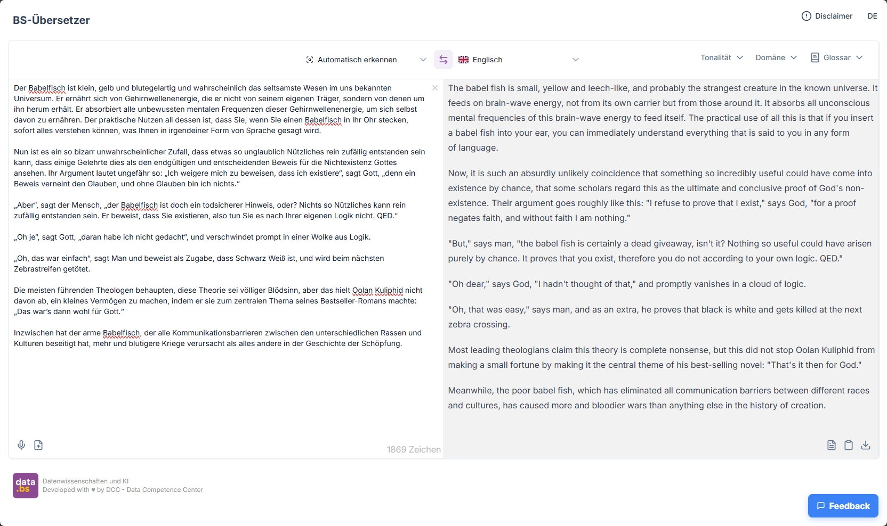

# BS Translator (Frontend)

BS Translator is a modern web application for advanced text translation with file processing capabilities. Built with Nuxt.js and TypeScript, it provides intelligent translation services with customizable tone, domain-specific terminology, and support for multiple file formats. This repository contains only the frontend code; the [backend](https://github.com/DCC-BS/bs-translator-backend) is written in Python FastAPI.

 [](https://biomejs.dev)

---

<p align="center">
  <a href="https://dcc-bs.github.io/documentation/">DCC Documentation & Guidelines</a> | <a href="https://www.bs.ch/daten/databs/dcc">DCC Website</a>
</p>

---



## Features

- **Intelligent Translation**: AI-powered translation between 50+ languages with auto-detection
- **Tone & Style Control**: Customizable translation tone (formal, informal, technical, creative, concise)
- **Domain-Specific Translation**: Specialized translations for legal, medical, technical, financial, and other domains
- **File Conversion**: Support for multiple file formats (TXT, DOCX, PPTX, XLSX, PDF, HTML, RTF, Markdown)
- **Custom Glossary**: Personal terminology management for consistent translations
- **Real-time Translation**: Live translation with streaming responses
- **Rich Text Output**: Markdown-formatted translations with rich text clipboard support
- **Document Export**: Download translations as Word documents
- **Multilingual Interface**: Available in English and German
- **Drag & Drop Support**: Easy file upload with visual feedback
- **Guided Onboarding Tour**: Built-in walkthrough with restart controls from the navigation bar
- **Installable PWA**: App manifest and icons for adding the translator to devices

## Technology Stack

- **Frontend**: [Nuxt.js](https://nuxt.com/) with TypeScript and Composition API
- **UI Framework**: [Nuxt UI](https://ui.nuxt.com/)
- **Package Manager**: [Bun](https://bun.sh/)
- **Internationalization**: Nuxt I18n
- **State Management**: Vue Composition API with composables
- **File Processing**: Vue Use for drag & drop and file handling
- **Markdown Processing**: Nuxt MDC for rich text rendering

## Setup

### Environment Configuration

Create a `.env` file in the project root with the required environment variables:

```env
API_URL=http://localhost:8000
LOG_LEVEL=debug
GITHUB_TOKEN=your_github_token_for_feedback # Optional, for feedback control integration
LOGGER_LAYER_URI=github:DCC-BS/nuxt-layers/pino-logger # Optional, pino logger layer
```

For Docker-based stacks, copy `docker/.env.backend.example` to `docker/.env.backend` and provide the required tokens (Hugging Face, Azure Entra IDs, HMAC secret) for the LLM, speech-to-text, and document parsing services.

### Install Dependencies

Make sure to install dependencies using Bun:

```bash
bun install
```

## Development

- **Start backend dependencies with Docker Compose (dev)**: This launches the backend and required services, but not the frontend.

```bash
docker compose -f docker-compose.dev.yml up -d --build
# Stop when done
docker compose -f docker-compose.dev.yml down
```

- **Start the frontend locally (Nuxt dev server)** on `http://localhost:3000`:

```bash
bun run dev
```

Note: In dev, the backend is exposed on `http://localhost:8000` (as configured in `docker-compose.dev.yml`). Ensure your `.env` has `API_URL=http://localhost:8000`.

### Backend Setup

The application requires a Python FastAPI backend. Make sure the backend is running on the configured `API_URL`.

## Testing & Linting

Format code with Biome:

```bash
bun run lint
```

Check and fix code issues:

```bash
bun run check
```

- **Run end-to-end tests (Playwright)**:

```bash
bunx playwright install --with-deps # first time only
bun run test:e2e
```

## Production (Docker Compose)

Run the full stack (nginx, frontend, backend, LLM) with Docker Compose:

```bash
docker compose -f docker-compose.yaml up -d --build
# Stop and remove
docker compose -f docker-compose.yaml down
```

Once started, access the application via `http://localhost:8090`.

The production stack requires both `.env` (frontend runtime config) and `docker/.env.backend` (backend/LLM settings) to be present before running Docker Compose.


## Project Architecture

- `app/`: Main application code
  - `components/`: Vue components for translation UI
  - `composables/`: Reusable composition functions for translation and file handling
  - `models/`: TypeScript interfaces and type definitions
  - `pages/`: Application pages and routes
  - `services/`: API communication services
  - `utils/`: Utility functions for file conversion and text processing
- `i18n/`: Internationalization configuration and locale files
- `server/`: API endpoints and server middleware (including health probes)
- `public/`: PWA icons and manifest assets served at the app root
- `docker/`: Docker Compose service definitions, nginx config, and backend env template

## Health Endpoints

- `/api/health/liveness`: Event-loop liveness check.
- `/api/health/startup`: Confirms the Nuxt server finished bootstrapping.
- `/api/health/readiness`: Verifies connectivity to the upstream backend API and returns `503` when dependencies are unavailable.

## Key Components

- **TranslateView**: Main translation interface with language selection and text input/output
- **LanguageSelectionView**: Smart language picker with flag icons and auto-detection
- **DomainSelectionView**: Domain-specific translation options
- **ToneSelectionView**: Translation tone and style selector
- **SourceTextView**: Text input with file drop zone and conversion capabilities
- **TargetTextView**: Translation output with markdown rendering and export options

## API Integration

The frontend communicates with a Python FastAPI backend through:

- `/api/translate/text` - Streaming text translation endpoint
- `/api/translate/image` - Image translation endpoint
- `/api/detect-language` - Automatic language detection endpoint
- `/api/convert` - File conversion endpoint
- `/api/transcribe/audio` - Audio transcription endpoint

## Supported Languages

The application supports 50+ languages including:
- European languages (German, English, French, Spanish, Italian, etc.)
- Asian languages (Chinese, Japanese, Korean, Hindi, etc.)
- Middle Eastern languages (Arabic, Persian, Hebrew, etc.)
- African languages (Swahili, Somali, Afrikaans, etc.)

## Translation Domains

Specialized translation support for:
- Government & Legal
- Medical & Pharmaceutical
- Technical & IT
- Financial & Business
- Scientific & Academic
- Marketing & Creative
- Education & Literature
- Tourism & Hospitality

## License

[MIT](LICENSE) © Data Competence Center Basel-Stadt

<a href="https://www.bs.ch/schwerpunkte/daten/databs/schwerpunkte/datenwissenschaften-und-ki"></a>

Datenwissenschaften und KI <br>
Developed with ❤️ by DCC - Data Competence Center

