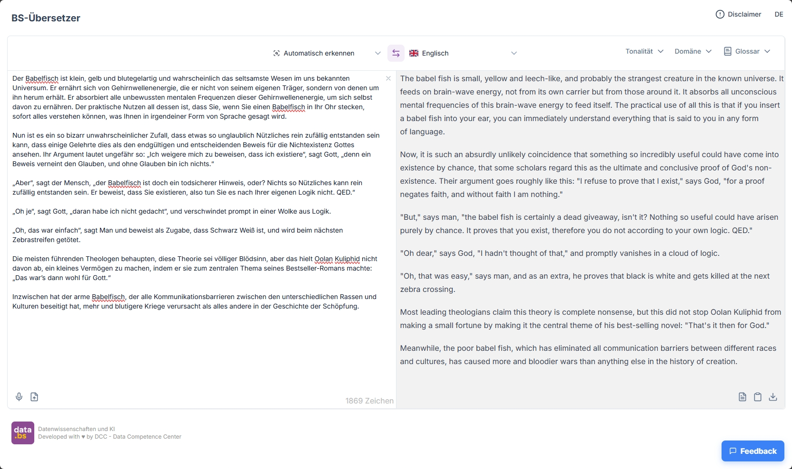

# BS Translator (Frontend)

BS Translator is a modern web application for advanced text translation with file processing capabilities. Built with Nuxt.js and TypeScript, it provides intelligent translation services with customizable tone, domain-specific terminology, and support for multiple file formats. This repository contains only the frontend code; the [backend](https://github.com/DCC-BS/bs-translator-backend) is written in Python FastAPI.

 [](https://biomejs.dev)

---

<p align="center">
  <a href="https://dcc-bs.github.io/documentation/">DCC Documentation & Guidelines</a> | <a href="https://www.bs.ch/daten/databs/dcc">DCC Website</a>
</p>

---



## Features

- **Intelligent Translation**: AI-powered translation between 50+ languages with auto-detection
- **Tone & Style Control**: Customizable translation tone (formal, informal, technical, creative, concise)
- **Domain-Specific Translation**: Specialized translations for legal, medical, technical, financial, and other domains
- **File Conversion**: Support for multiple file formats (TXT, DOCX, PPTX, XLSX, PDF, HTML, RTF, Markdown)
- **Custom Glossary**: Personal terminology management for consistent translations
- **Real-time Translation**: Live translation with streaming responses
- **Rich Text Output**: Markdown-formatted translations with rich text clipboard support
- **Document Export**: Download translations as Word documents
- **Multilingual Interface**: Available in English and German
- **Drag & Drop Support**: Easy file upload with visual feedback
- **Guided Onboarding Tour**: Built-in walkthrough with restart controls from the navigation bar
- **Installable PWA**: App manifest and icons for adding the translator to devices

## Technology Stack

- **Frontend**: [Nuxt.js](https://nuxt.com/) with TypeScript and Composition API
- **UI Framework**: [Nuxt UI](https://ui.nuxt.com/)
- **Package Manager**: [Bun](https://bun.sh/)
- **Internationalization**: Nuxt I18n
- **State Management**: Vue Composition API with composables
- **File Processing**: Vue Use for drag & drop and file handling
- **Markdown Processing**: Nuxt MDC for rich text rendering

## Setup

### Environment Configuration

Create a `.env` file in the project root with the required environment variables:

```bash
APP_MODE=dev  # can be dev, ci, build or prod see https://dcc-bs.github.io/documentation/dev-setup/varlock.html
```

#### Optional Environment Variables

The following environment variables have defaults and can be overridden as needed:

| Variable | Description | Default | Type |
|----------|-------------|---------|------|
| **App Configuration** |
| `USE_FEEDBACK` | Enable feedback feature | `true` | boolean |
| `DUMMY` | Use dummy data (no backend requests) | `false` | string |
| **Build-time Variables** |
| `LOGGER_LAYER_URI` | Logger layer Nuxt module | `github:DCC-BS/nuxt-layers/pino-logger` | URL |
| **Runtime Variables** |
| `API_PORT` | Backend API port | `8000` | port |
| `NUXT_API_URL` | Backend API URL | `http://localhost:8000` (dev) | URL (public) |
| `NUXT_FEEDBACK_GITHUB_TOKEN` | GitHub token for feedback | - | string (sensitive, required if `USE_FEEDBACK=true`) |
| `NUXT_PUBLIC_LOGGER_LOG_LEVEL` | Frontend log level | `debug` (dev), `info` (prod) | enum: trace, debug, info, warn, error, fatal |
| `LOG_LEVEL` | Server log level | `debug` | enum: trace, debug, info, warn, error, fatal |

> **Note:** Build-time variables (`LOGGER_LAYER_URI`) are resolved during `nuxt build` and must be passed as build arguments in Docker.

### Varlock & Secrets Management

We use [varlock](https://varlock.dev/) for environment variable validation and default value management. Varlock integrates with the Docker build process and can optionally fetch secrets from Proton Pass during development.

To validate and load environment variables:

```bash
varlock load
```

#### Proton Pass Integration (Optional)

For automatic secret retrieval from Proton Pass, ensure you have:
1. Install [pass-cli](https://github.com/DCC-BS/pass-cli)
2. Authenticate with Proton Pass: `pass-cli login`
3. Validate environment: `varlock load`

> **Note:** Proton Pass integration is optional. If you prefer to set environment variables manually, you can skip the Proton Pass setup and provide values directly in your `.env` file or environment. Varlock will use the manually provided values instead of fetching from Proton Pass.

In production (Docker), varlock runs as the container entrypoint, loading secrets at runtime.

### Install Dependencies

Make sure to install dependencies using Bun:

```bash
bun install
```

## Development

### Start the Development Server

```bash
bun run dev
```

### Dummy Mode

For development without a backend connection, use dummy mode which returns mock data instead of calling the backend API:

```bash
bun run dummy
```

This allows frontend development without running the Python backend services.

### Backend Services

This frontend requires the [BS Translator backend](https://github.com/DCC-BS/bs-translator-backend) service. The backend and all related services (LLM, Faster Whisper, Docling) are configured in the `docker/` folder.

#### Development Mode (Backend Only)

Start only the backend services for development:

```bash
bun run docker:up
```

Stop backend services:

```bash
bun run docker:down
```

> **Note:** In dev, the backend is exposed on `http://localhost:8000` (as configured in `docker/docker-compose.dev.yml`). Ensure your `.env` has `APP_MODE=dev` so `NUXT_API_URL` defaults to `http://localhost:8000`.

#### Full Stack with Nginx

To run all services including the frontend behind an nginx reverse proxy:

```bash
cd docker
varlock run -- docker compose up
```

This starts:
- **Frontend** (Nuxt.js app)
- **Backend** (Python FastAPI)
- **LLM Service** (vLLM with Qwen model)
- **Faster Whisper** (Speech-to-text)
- **Docling** (Document parsing)
- **Nginx** (Reverse proxy)

> **Note:** Ensure you have varlock configured with Proton Pass for environment variable management.

## Project Architecture

```
app/
├── components/       # Vue components for translation UI
├── composables/      # Reusable composition functions
├── models/           # TypeScript interfaces and type definitions
├── pages/            # Application pages and routes
├── services/         # API communication services
└── utils/            # Utility functions for file conversion and text processing
i18n/                 # Internationalization configuration and locale files
server/               # API endpoints and server middleware (including health probes)
public/               # PWA icons and manifest assets served at the app root
docker/               # Docker Compose service definitions, nginx config, and env schemas
shared/               # Shared types and utilities
scripts/              # Development scripts (docker-up, docker-down)
```

## Testing & Linting

Format code with Biome:

```bash
bun run lint
```

Check and fix code issues:

```bash
bun run check
```

- **Run end-to-end tests (Playwright)**:

```bash
bunx playwright install --with-deps # first time only
bun run test:e2e
```

## Health Endpoints

- `/api/health/liveness`: Event-loop liveness check.
- `/api/health/startup`: Confirms the Nuxt server finished bootstrapping.
- `/api/health/readiness`: Verifies connectivity to the upstream backend API and returns `503` when dependencies are unavailable.

## Key Components

- **TranslateView**: Main translation interface with language selection and text input/output
- **LanguageSelectionView**: Smart language picker with flag icons and auto-detection
- **DomainSelectionView**: Domain-specific translation options
- **ToneSelectionView**: Translation tone and style selector
- **SourceTextView**: Text input with file drop zone and conversion capabilities
- **TargetTextView**: Translation output with markdown rendering and export options

## API Integration

The frontend communicates with a Python FastAPI backend through:

- `/api/translate/text` - Streaming text translation endpoint
- `/api/translate/image` - Image translation endpoint
- `/api/detect-language` - Automatic language detection endpoint
- `/api/convert` - File conversion endpoint
- `/api/transcribe/audio` - Audio transcription endpoint

## Docker Deployment

The application includes a multi-stage Dockerfile for production deployment with varlock runtime validation.

### Docker Build Arguments

The Dockerfile accepts the following build-time arguments:

| Argument | Default | Description |
|----------|---------|-------------|
| `LOGGER_LAYER_URI` | `github:DCC-BS/nuxt-layers/pino-logger` | Logging layer implementation. |

These are resolved during `nuxt build` and must be passed as build arguments:

```bash
# Build the image
docker build -t bs-translator-frontend .

# Run the container
docker run -p 3000:3000 bs-translator-frontend
```

## License

[MIT](LICENSE) © Data Competence Center Basel-Stadt

<a href="https://www.bs.ch/schwerpunkte/daten/datenwissenschaften-und-ki"></a>

Datenwissenschaften und KI <br>
Developed with ❤️ by DCC - Data Competence Center
